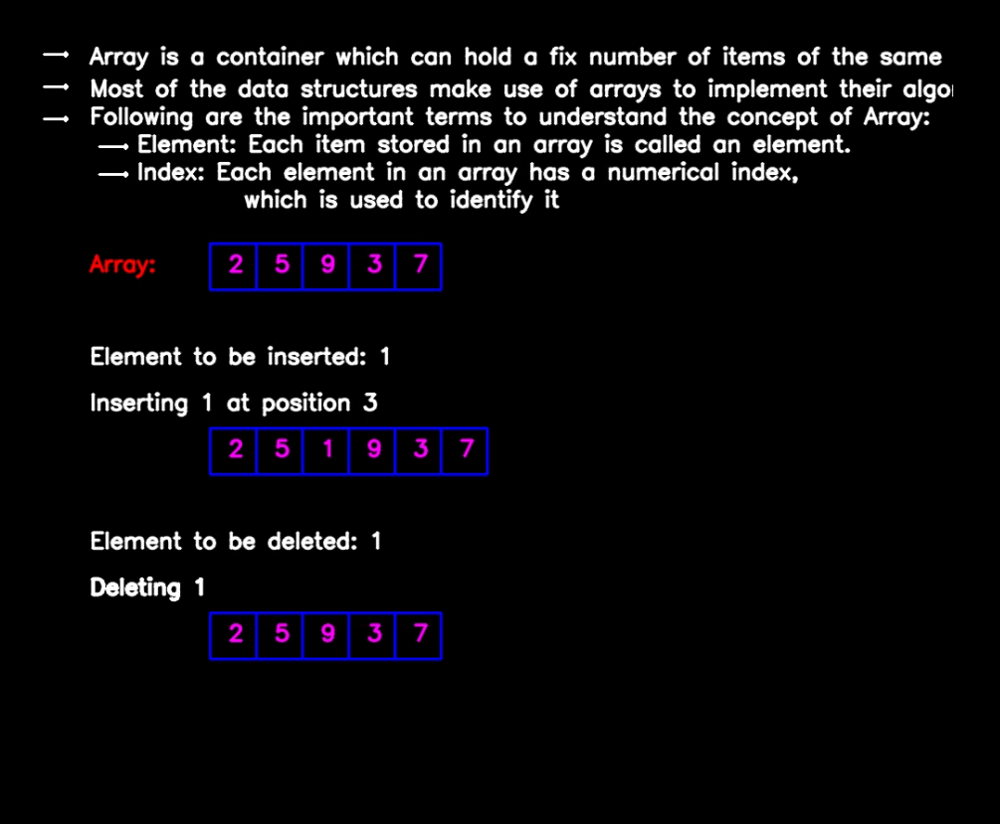

# CONCEPT OF ARRAYS

### **Concept:**
- A list of numbers is written and recognised using CNN models. 
- Array is a container which can hold a fix number of items of the same type
- Most of the data structures make use of arrays to implement their algorithms
- Following are the important terms to understand the concept of Array:
    * Element: Each item stored in an array is called an element
    * Index: Each element in an array has a numerical index, which is used to identify it 

### **Required Packages:**
```
pip install opencv-python==3.4.1
pip install tensorflow==1.13.1
pip install Keras==2.0.6
pip install python==3.6.5
```
### **Model:**
- Model used for this code can be downloaded from the following link: <br>
    https://gitlab.com/school-of-curious/reshma-ramesh-babu/blob/develope/arrays/model_mnist3.h5
- Save it in the same folder as the python file and run the code

### **Approach:**
- A list of numbers is written and recognised- these are the elements of the array.
- Basic insertion is performed in the array and its indexes are displayed.
- An element is written and read for insertion at both the end and at a particular position (position is read).
- Basic deletion of that element from the array is performed. 

### **Code:**
- Save the following code in a python file and run it
```python
#importing libraries and dependencies
import cv2
import matplotlib.pyplot as plt
import numpy as np
from keras.models import Sequential
from keras.layers import Convolution2D, MaxPooling2D
from keras.layers import Flatten, Dense
from queue import Queue

#creating the model
def create_model():
    model = Sequential()
    model.add(Convolution2D(16, 5, 5, activation='relu', input_shape=(28,28, 3)))
    model.add(MaxPooling2D(2, 2))

    model.add(Convolution2D(32, 5, 5, activation='relu'))
    model.add(MaxPooling2D(2, 2))

    model.add(Flatten())
    model.add(Dense(1000, activation='relu'))

    model.add(Dense(11, activation='softmax'))
    return model

#loading model
model = create_model()
model.load_weights('../model_mnist3.h5')
def arrayop(arr,elt,pos):
    cv2.putText(output,"Array:",(100,300),cv2.FONT_HERSHEY_SIMPLEX,0.8,(0,0,255),2,cv2.LINE_AA)
    cv2.putText(output,"Index:",(100,400),cv2.FONT_HERSHEY_SIMPLEX,0.8,(0,0,255),2,cv2.LINE_AA)
    x = 250
    y = 300
    p = 230
    q = 270
    c = 250
    d = 370
    n = len(arr)
    for b in range(n):
        cv2.rectangle(output,(p,q),(p + 50,q + 50),(255,0,0),2)
        p += 50
    p = 230
    for i in range(n):
        if count >= i:
            cv2.rectangle(output,(180,335),(900,480),(0,0,0),-1)
            cv2.arrowedLine(output,(c,d),(c,d-30),(0,255,255),2)
            cv2.putText(output,str(arr[i]),(x,y),cv2.FONT_HERSHEY_SIMPLEX,0.8,(255,0,255),2,cv2.LINE_AA)
            cv2.putText(output,str(i),(c-10,d+35),cv2.FONT_HERSHEY_SIMPLEX,0.8,(255,255,255),2,cv2.LINE_AA)
            x += 50
            c += 50
    if count1 > 0:
        x = 250
        p = 230
        cv2.rectangle(output,(90,335),(900,480),(0,0,0),-1)
        cv2.putText(output,"Element to be inserted: "+str(elt),(100,400),cv2.FONT_HERSHEY_SIMPLEX,0.8,(255,255,255),2,cv2.LINE_AA)
        n = len(arr)
        for b in range(n):
            cv2.rectangle(output,(p,q+200),(p + 50,q + 250),(255,0,0),2)
            p += 50
        cv2.putText(output,"Insertion at the end: ",(100,450),cv2.FONT_HERSHEY_SIMPLEX,0.8,(255,255,255),2,cv2.LINE_AA)
        for i in range(n):
            cv2.putText(output,str(arr[i]),(x,y+200),cv2.FONT_HERSHEY_SIMPLEX,0.8,(255,0,255),2,cv2.LINE_AA)
            x += 50
        cv2.rectangle(output,(90,660),(900,680),(0,0,0),-1)
        arr.append(elt)
        n = len(arr)
        if count1 > 1:
            cv2.rectangle(output,(p,q+200),(p + 50,q + 250),(255,0,0),2)
            cv2.putText(output,str(elt),(x,y+200),cv2.FONT_HERSHEY_SIMPLEX,0.8,(255,0,255),2,cv2.LINE_AA)
    if count2 > 0:
        x = 250
        p = 230
        n = len(arr)
        cv2.rectangle(output,(90,335),(900,680),(0,0,0),-1)
        cv2.putText(output,"Element to be inserted: "+str(elt),(100,400),cv2.FONT_HERSHEY_SIMPLEX,0.8,(255,255,255),2,cv2.LINE_AA)
        if count1 > 0:
            arr.remove(arr[n-1])
        cv2.putText(output,"Inserting "+str(elt)+" at position "+str(pos),(100,450),cv2.FONT_HERSHEY_SIMPLEX,0.8,(255,255,255),2,cv2.LINE_AA)
        arr.insert(int(pos)-1,elt)
        n = len(arr)
        x = 250
        p = 230
        for b in range(n):
            cv2.rectangle(output,(p,q+200),(p + 50,q + 250),(255,0,0),2)
            p += 50
        for i in range(n):
            if count2 >= i:
                cv2.putText(output,str(arr[i]),(x,y+200),cv2.FONT_HERSHEY_SIMPLEX,0.8,(255,0,255),2,cv2.LINE_AA)
                x += 50
    if count3 > 0:
        x = 250
        p = 230
        n = len(arr)
        cv2.putText(output,"Element to be deleted: "+str(elt),(100,600),cv2.FONT_HERSHEY_SIMPLEX,0.8,(255,255,255),2,cv2.LINE_AA)
        arr.remove(elt)
        n = len(arr)
        for b in range(n):
            cv2.rectangle(output,(p,q+400),(p + 50,q + 450),(255,0,0),2)
            p += 50
        for i in range(n):
            if count3 >= i:
                cv2.putText(output,"Deleting "+str(elt),(100,650),cv2.FONT_HERSHEY_SIMPLEX,0.8,(255,255,255),2,cv2.LINE_AA)
                cv2.putText(output,str(a[i]),(x,y+400),cv2.FONT_HERSHEY_SIMPLEX,0.8,(255,0,255),2,cv2.LINE_AA)
                x += 50

count = 0
count1 = 0
count2 = 0
count3 = 0
count4 = 0
global ARR
import operator
cap = cv2.VideoCapture(1)
st = ""
flag = 0
global ARR
while(True):
    #reading frames from camera
    ret, frame1 = cap.read()
    output = np.zeros((1000,1200,3),np.uint8)
    if cv2.waitKey(1) & 0xFF == ord('a'):
        count += 1
        flag = 1
    if cv2.waitKey(1) & 0xFF == ord('i'):
        count1 += 1
        flag = 1
    if cv2.waitKey(1) & 0xFF == ord('m'):
        count2 += 1
        flag = 1
    if cv2.waitKey(1) & 0xFF == ord('d'):
        count3 += 1
        flag = 1
    if cv2.waitKey(1) & 0xFF == ord('c'):
        count4 += 1
    if flag == 0:
        #splitting the frame thrice in order to read the two strings and the frame capacity
        frame2 = frame1[50:200,100:700]
        frame = frame2.copy()
        frame_new= frame2.copy()
        
        th1 = 63
        ret, img = cv2.threshold(frame, th1, 255, cv2.THRESH_BINARY_INV)
        cvt = cv2.cvtColor(img, cv2.COLOR_BGR2GRAY)
        imagenew,contours, hierarchy = cv2.findContours(cvt,cv2.RETR_EXTERNAL,cv2.CHAIN_APPROX_SIMPLE)

        thisdict = {}
        

        flag=0
        noted_y=0
        mylist = []
        for c in contours:
            (x, y, w, h)= cv2.boundingRect(c)
            if (w>20) or (h>20):
                mylist.append((x,y,w,h))
        
        th2 = 64 #change thresholding of every contour
        for i in range(0, len(mylist)):
            x = mylist[i][0]
            y = mylist[i][1]
            w = mylist[i][2]
            h = mylist[i][3]
            if h/w>3:
                x=x-10
                w=w+20
            if w/h>3:
                y=y-60
                h=h+110
            y=y-27
            x=x-25
            w=w+50
            h=h+54
            cv2.rectangle(frame1,(x,y),(x+w,y+h), (0,0, 255), 2)
            img1 = frame_new[y:y+h, x:x+w]
            ret, gray = cv2.threshold(img1,th2,255,cv2.THRESH_BINARY )
            try:
                im = cv2.resize(gray, (28,28))
                ar = np.array(im).reshape((28,28,3))
                ar = np.expand_dims(ar, axis=0)
                prediction = model.predict(ar)[0]
                #prediction of class labels
                for i in range(0,12):
                    if prediction[i]==1.0:
                        if i==0:
                            j= ","
                        if i==1:
                            j= "0"
                        if i==2:
                            j= "1"
                        if i==3:
                            j= "2"
                        if i==4:
                            j= "3"
                        if i==5:
                            j= "4"
                        if i==6:
                            j= "5"
                        if i==7:
                            j= "6"
                        if i==8:
                            j= "7"
                        if i==9:
                            j= "8"
                        if i==10:
                            j= "9"
                        
                #printing prediction
                        cv2.putText(frame1, j, (x,y), cv2.FONT_HERSHEY_SIMPLEX, 2, (0, 255, 0), 2, cv2.LINE_AA)
                        thisdict[x]= str(j)
            except:
                d=0
        sort = sorted(thisdict.items(), key=operator.itemgetter(0))
        #print(sort)
        s = ""
        for x in range(0,len(sort)):
            s=s+str(sort[x][1])
        print(s)

        frame3 = frame1[200:400,100:700]
        frame = frame3.copy()
        frame_new= frame3.copy()
        
        th1 = 63
        ret, img2 = cv2.threshold(frame, th1, 255, cv2.THRESH_BINARY_INV)
        cvt1 = cv2.cvtColor(img2, cv2.COLOR_BGR2GRAY)
        imagenew,contours, hierarchy = cv2.findContours(cvt1 ,cv2.RETR_EXTERNAL,cv2.CHAIN_APPROX_SIMPLE)

        thisdict = {}
        
        flag=0
        noted_y=0
        mylist = []
        for c in contours:
            (x, y, w, h)= cv2.boundingRect(c)
            if (w>20) or (h>20):
                mylist.append((x,y,w,h))
        
        th2 = 64 #change thresholding of every contour
        for i in range(0, len(mylist)):
            x = mylist[i][0]
            y = mylist[i][1]
            w = mylist[i][2]
            h = mylist[i][3]
            if h/w>3:
                x=x-10
                w=w+20
            if w/h>3:
                y=y-60
                h=h+110
            y=y-27
            x=x-25
            w=w+50
            h=h+54
            cv2.rectangle(frame1,(x,y),(x+w,y+h), (0,0, 255), 2)
            img1 = frame_new[y:y+h, x:x+w]
            ret, gray1 = cv2.threshold(img1,th2,255,cv2.THRESH_BINARY )
            try:
                im = cv2.resize(gray1, (28,28))
                ar = np.array(im).reshape((28,28,3))
                ar = np.expand_dims(ar, axis=0)
                prediction = model.predict(ar)[0]
                #prediction of class labels
                for i in range(0,12):
                    if prediction[i]==1.0:
                        if i==0:
                            j= ","
                        if i==1:
                            j= "0"
                        if i==2:
                            j= "1"
                        if i==3:
                            j= "2"
                        if i==4:
                            j= "3"
                        if i==5:
                            j= "4"
                        if i==6:
                            j= "5"
                        if i==7:
                            j= "6"
                        if i==8:
                            j= "7"
                        if i==9:
                            j= "8"
                        if i==10:
                            j= "9"
                        
                #printing prediction
                        cv2.putText(frame1, j, (x,y), cv2.FONT_HERSHEY_SIMPLEX, 2, (0, 255, 0), 2, cv2.LINE_AA)
                        thisdict[x]= str(j)
            except:
                d=0

        sort = sorted(thisdict.items(), key=operator.itemgetter(0))
        s1 = ""
        for x in range(0,len(sort)):
            s1=s1+str(sort[x][1])
            #cv2.putText(frame1, s, (100,80), cv2.FONT_HERSHEY_SIMPLEX, 2, (255, 0, 0), 2, cv2.LINE_AA)  

        frame4 = frame1[350:600,100:700]
        frame = frame4.copy()
        frame_new= frame4.copy()
        
        th1 = 63
        ret, img1 = cv2.threshold(frame, th1, 255, cv2.THRESH_BINARY_INV)
        
        cvt2 = cv2.cvtColor(img1, cv2.COLOR_BGR2GRAY)
        imagenew,contours, hierarchy = cv2.findContours(cvt2 ,cv2.RETR_EXTERNAL,cv2.CHAIN_APPROX_SIMPLE)

        thisdict = {}
        
        flag=0
        noted_y=0
        mylist = []
        for c in contours:
            (x, y, w, h)= cv2.boundingRect(c)
            if (w>20) or (h>20):
                mylist.append((x,y,w,h))
        
        th2 = 64 #change thresholding of every contour
        for i in range(0, len(mylist)):
            x = mylist[i][0]
            y = mylist[i][1]
            w = mylist[i][2]
            h = mylist[i][3]
            if h/w>3:
                x=x-10
                w=w+20
            if w/h>3:
                y=y-60
                h=h+110
            y=y-10
            x=x-10
            w=w+20
            h=h+20
            cv2.rectangle(frame1,(x,y),(x+w,y+h), (0,0, 255), 2)
            img1 = frame_new[y:y+h, x:x+w]
            ret, gray1 = cv2.threshold(img1,th2,255,cv2.THRESH_BINARY )
            try:
                im = cv2.resize(gray1, (28,28))
                #cv2.imshow('img',gray)

                ar = np.array(im).reshape((28,28,3))
                ar = np.expand_dims(ar, axis=0)
                prediction = model.predict(ar)[0]
                #prediction of class labels
                for i in range(0,12):
                    if prediction[i]==1.0:
                        if i==0:
                            j= ","
                        if i==1:
                            j= "0"
                        if i==2:
                            j= "1"
                        if i==3:
                            j= "2"
                        if i==4:
                            j= "3"
                        if i==5:
                            j= "4"
                        if i==6:
                            j= "5"
                        if i==7:
                            j= "6"
                        if i==8:
                            j= "7"
                        if i==9:
                            j= "8"
                        if i==10:
                            j= "9"
                        
                #printing prediction
                        cv2.putText(frame1, j, (x,y), cv2.FONT_HERSHEY_SIMPLEX, 2, (0, 255, 0), 2, cv2.LINE_AA)
                        thisdict[x]= str(j)
            except:
                d=0

        sort = sorted(thisdict.items(), key=operator.itemgetter(0))
        s2 = ""
        for x in range(0,len(sort)):
            s2=s2+str(sort[x][1])
            #cv2.putText(frame1, s, (100,80), cv2.FONT_HERSHEY_SIMPLEX, 2, (255, 0, 0), 2, cv2.LINE_AA)  
    try:
        a = list(s)
        a = s.split(',')
        elt = int(s1)
        pos = int(s2)
        cv2.arrowedLine(output,(50,65),(75,65),(255,255,255),2)
        cv2.putText(output,"Array is a container which can hold a fix number of items of the same type",(100,75),cv2.FONT_HERSHEY_SIMPLEX,0.8,(255,255,255),2,cv2.LINE_AA)
        cv2.arrowedLine(output,(50,100),(75,100),(255,255,255),2)
        cv2.putText(output,"Most of the data structures make use of arrays to implement their algorithms",(100,110),cv2.FONT_HERSHEY_SIMPLEX,0.8,(255,255,255),2,cv2.LINE_AA)
        cv2.arrowedLine(output,(50,135),(75,135),(255,255,255),2)
        cv2.putText(output,"Following are the important terms to understand the concept of Array:",(100,140),cv2.FONT_HERSHEY_SIMPLEX,0.8,(255,255,255),2,cv2.LINE_AA)
        cv2.arrowedLine(output,(110,165),(140,165),(255,255,255),2)
        cv2.putText(output,"    Element: Each item stored in an array is called an element.",(100,170),cv2.FONT_HERSHEY_SIMPLEX,0.8,(255,255,255),2,cv2.LINE_AA)
        cv2.arrowedLine(output,(110,195),(140,195),(255,255,255),2)
        cv2.putText(output,"    Index: Each element in an array has a numerical index,",(100,200),cv2.FONT_HERSHEY_SIMPLEX,0.8,(255,255,255),2,cv2.LINE_AA)
        cv2.putText(output,"             which is used to identify it",(100,230),cv2.FONT_HERSHEY_SIMPLEX,0.8,(255,255,255),2,cv2.LINE_AA)
        arrayop(a,elt,pos)
    except:
        pass
    if count4 >= 1:
            frame5=np.zeros((1000,1000,3),np.uint8)
            cv2.putText(frame5,"n = input('Enter number of integers you want:')",(50,60),0,0.8,(10,100,255),2)
            cv2.putText(frame5,"a = list()",(50,90),0,0.8,(10,100,255),2)
            cv2.putText(frame5,"print('Enter integers of the array you wish to create:')",(50,120),0,0.8,(10,100,255),2)
            cv2.putText(frame5,"for i in range(int(n)):",(50,150),0,0.8,(10,100,255),2)
            cv2.putText(frame5,"    print('Number ',i+1,':',end='')",(50,180),0,0.8,(10,100,255),2)
            cv2.putText(frame5,"    a.append(input())",(50,210),0,0.8,(10,100,255),2)
            cv2.putText(frame5," print('Integer array:',a)",(50,240),0,0.8,(10,100,255),2)
            cv2.putText(frame5,"n = len(a)",(50,270),0,0.8,(10,100,255),2)
            cv2.putText(frame5,"x = input('Enter element to be inserted:')",(50,300),0,0.8,(10,100,255),2)
            cv2.putText(frame5,"pos = input('Enter 1 for inserting at end, 2 for some other position:')",(50,330),0,0.8,(10,100,255),2)
            cv2.putText(frame5,"print(pos)",(50,360),0,0.8,(10,100,255),2)
            cv2.putText(frame5,"if int(pos) == 1:",(50,390),0,0.8,(10,100,255),2)
            cv2.putText(frame5,"    a.append(x)",(50,420),0,0.8,(10,100,255),2)
            cv2.putText(frame5,"    print('Array after insertion:',a)",(50,450),0,0.8,(10,100,255),2)
            cv2.putText(frame5,"else:",(50,480),0,0.8,(10,100,255),2)
            cv2.putText(frame5,"    pos1 = input('Enter position at which you want to insert element:')",(50,510),0,0.8,(10,100,255),2)
            cv2.putText(frame5,"    n = len(a)",(50,540),0,0.8,(10,100,255),2)
            cv2.putText(frame5,"    a.insert(int(pos1)-1,x)",(50,570),0,0.8,(10,100,255),2)
            cv2.putText(frame5,"    print('Array after insertion:',a) ",(50,600),0,0.8,(10,100,255),2)
            cv2.putText(frame5,"delete = input('Enter element you want to delete:')",(50,630),0,0.8,(10,100,255),2)
            cv2.putText(frame5,"a.remove(delete)",(50,660),0,0.8,(10,100,255),2)
            cv2.putText(frame5,"print('Array after deletion:',a)",(50,690),0,0.8,(10,100,255),2)
            cv2.imshow("Concept of Arrays",frame5)                  
    cv2.imshow('frame1', frame1)
    cv2.imshow('frame3', cvt1)
    cv2.imshow('frame2', cvt)
    cv2.imshow('frame4',frame4)
    #cv2.imshow('frame3', img1)
    cv2.imshow('Output',output)
    if cv2.waitKey(1) & 0xFF == ord('q'):
        break        
cap.release()
#code for basic code generation for concept of arrays
f1 = open("arrayconcept.py","w+")
code='''

n = input("Enter number of integers you want:")
a = list()
print("Enter integers of the array you wish to create:")
for i in range(int(n)):
    print("Number ",i+1,":",end="")
    a.append(input())
print("Integer array:",a)
n = len(a)
x = input("Enter element to be inserted:")
pos = input("Enter 1 for inserting at end, 2 for some other position:")
print(pos)
if int(pos) == 1:
    a.append(x)
    print("Array after insertion:",a)
else:
    pos1 = input("Enter position at which you want to insert element:")
    n = len(a)    
    a.insert(int(pos1)-1,x)
            
    print("Array after insertion:",a)
delete = input("Enter element you want to delete:")
a.remove(delete)
print("Array after deletion:",a)
'''
f1.write(code)
f1.close()
```
- Run the above code as follows
```
python3 arrays.py
```

### **Operation:**
- A list of numbers is read and taken as input for the elements of the array
- Main frame from which handwritten input is read is split into three frames: one to take the elements of the array, one to take the element to be inserted and deleted, and the other to take the position at which the element should be inserted
- Basic insertion and indexing is displayed on pressing the key 'a'
- Insertion at the end (appending the element) is displayed on pressing the key 'i'
- Insertion at a particular position(both element to be inserted and position are read) is displayed on pressing the key 'm'
- Basic deletion of any element is displayed on pressing the key 'd'
- Basic code generation for concept of arrays is displayed on pressing the key 'c'

### **Output Screenshot:**


### **Demo video link:**

  https://www.dropbox.com/s/kecyr2e0pre0ezi/arrays.mp4?dl=0
