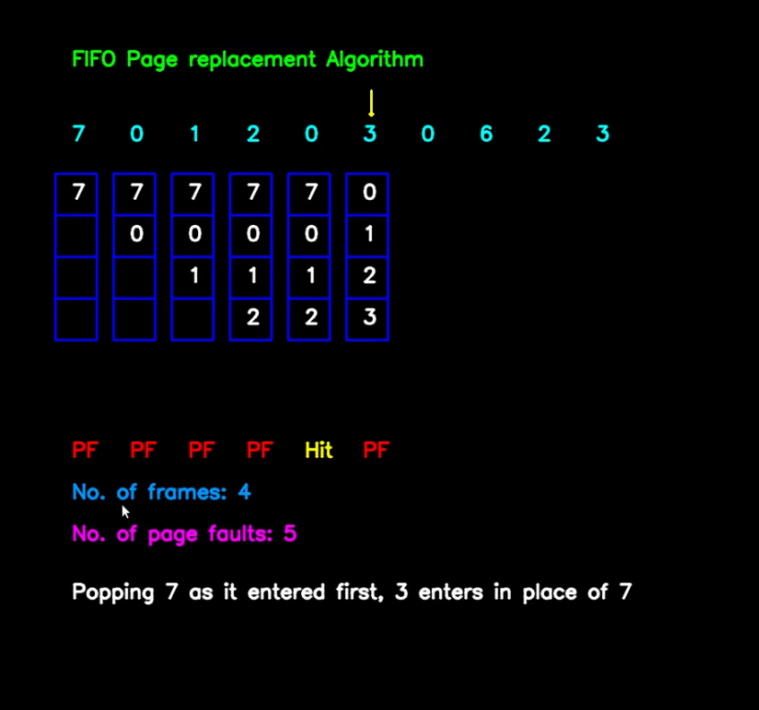
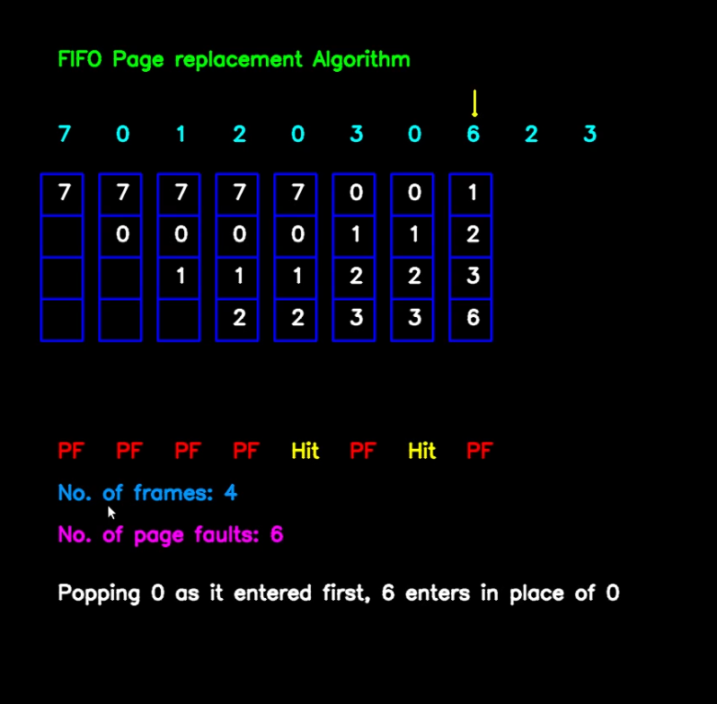
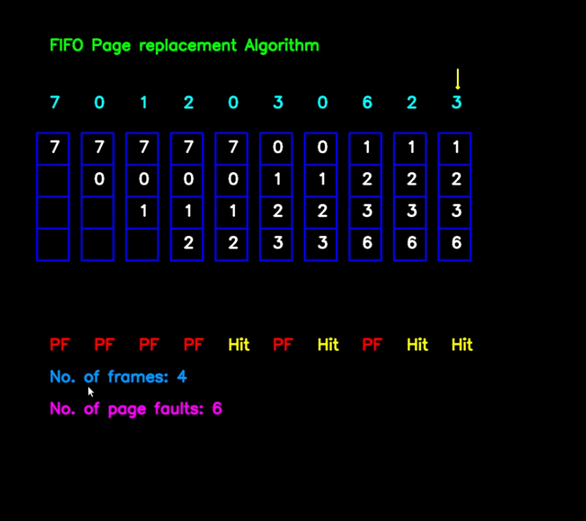

# FIFO PAGE REPLACEMENT ALGORITHM

### **Concept:**
- A list of numbers is written and detected as a string for the FIFO page replacement using CNN models.
- Page Replacement is performed using FIFO algorithm. A list of pages is taken as input and they are allocated frames using FIFO algorithm
- FIFO page replacement algorithm works as, the first page that enters is replaced and the entering page is allocated memory just as the name says, First In First Out. 

### **Required Packages:**
```
pip install opencv-python==3.4.1
pip install tensorflow==1.13.1
pip install Keras==2.0.6
pip install python==3.6.5
```
### **Model:**
- Model used for this code can be downloaded from the following link: <br>
    https://gitlab.com/school-of-curious/reshma-ramesh-babu/blob/develope/fifopaging/model_mnist3.h5
- Save it in the same folder as the python file and run the code

### **Approach:**
- A list of numbers is taken as input- these are the pages to which memory has to be allocated. 
- Number of frames available is also taken as input
- Memory is allocated using FIFO page replacement algorithm
- The new page entering is allocated memory by deallocating memory from the page that entered first, i.e First In First Out

### **Code:**
- Save the following code in a python file and run it 
```python
#importing libraries and dependencies
import cv2
import matplotlib.pyplot as plt
import numpy as np
from keras.models import Sequential
from keras.layers import Convolution2D, MaxPooling2D
from keras.layers import Flatten, Dense
from queue import Queue

#creating the model
def create_model():
    model = Sequential()
    model.add(Convolution2D(16, 5, 5, activation='relu', input_shape=(28,28, 3)))
    model.add(MaxPooling2D(2, 2))

    model.add(Convolution2D(32, 5, 5, activation='relu'))
    model.add(MaxPooling2D(2, 2))

    model.add(Flatten())
    model.add(Dense(1000, activation='relu'))

    model.add(Dense(11, activation='softmax'))
    return model

#loading model
model = create_model()
model.load_weights('../model_mnist3.h5')
x = 80
y = 140
# Function to find page faults using FIFO  
def pageFaults(pages, n, capacity): 
    global x,y 
    # To represent set of current pages.  
    # We use an unordered list so that we 
    # quickly check if a page is present 
    # in set or not  
    s = []  
    # To store the pages in FIFO manner  
    indexes = Queue()  
    p = 80
    q = 210
    c = 100
    d = 240
    x = 110
    y = 110
    # Start from initial page  
    page_faults = 0
    for i in range(n): 
        if count >= i:
            cv2.rectangle(output,(90,105),(900,145),(0,0,0),-1)
            cv2.arrowedLine(output,(x,y),(x,y+30),(0,255,255),2)
            q = 210
            for b in range(capacity):
                cv2.rectangle(output,(p,q),(p + 50,q + 50),(255,0,0),2)
                q += 50
            # Check if the set can hold  
            # more pages  
            if (len(s) < capacity): 
                
                # Insert it into set if not present  
                # already which represents page fault  
                if (pages[i] not in s): 
                    s.append(pages[i])  
    
                    # increment page fault  
                    page_faults += 1
    
                    # Push the current page into 
                    # the queue  
                    indexes.put(pages[i]) 
                    d = 240
                    for k in range(len(s)):
                        cv2.putText(output,str(s[k]),(c,d),cv2.FONT_HERSHEY_SIMPLEX,0.8,(255,255,255),2,cv2.LINE_AA)
                        d += 50
                    cv2.putText(output,"PF",(c,550),cv2.FONT_HERSHEY_SIMPLEX,0.8,(0,0,255),2,cv2.LINE_AA)
                    cv2.rectangle(output,(100,650),(900,750),(0,0,0),-1)
                else:
                    d = 240
                    for k in range(len(s)):
                        cv2.putText(output,str(s[k]),(c,d),cv2.FONT_HERSHEY_SIMPLEX,0.8,(255,255,255),2,cv2.LINE_AA)
                        d += 50
                    cv2.putText(output,"Hit",(c,550),cv2.FONT_HERSHEY_SIMPLEX,0.8,(0,255,255),2,cv2.LINE_AA)
                    cv2.rectangle(output,(100,650),(900,750),(0,0,0),-1)
    
            # If the set is full then need to perform FIFO  
            # i.e. remove the first page of the queue from  
            # set and queue both and insert the current page  
            else: 
                
                # Check if current page is not  
                # already present in the set  
                if (pages[i] not in s): 
                    
                    # Pop the first page from the queue  
                    val = indexes.queue[0]  
    
                    indexes.get()  
    
                    # Remove the indexes page  
                    s.remove(val)  
    
                    # insert the current page  
                    s.append(pages[i])  
    
                    # push the current page into  
                    # the queue  
                    indexes.put(pages[i])  
    
                    # Increment page faults  
                    page_faults += 1
                    d = 240
                    for k in range(len(s)):
                        cv2.putText(output,str(s[k]),(c,d),cv2.FONT_HERSHEY_SIMPLEX,0.8,(255,255,255),2,cv2.LINE_AA)
                        d += 50
                    cv2.putText(output,"PF",(c,550),cv2.FONT_HERSHEY_SIMPLEX,0.8,(0,0,255),2,cv2.LINE_AA)
                    cv2.rectangle(output,(100,650),(900,750),(0,0,0),-1)
                    cv2.putText(output,"Popping "+str(val)+" as it entered first, "+str(pages[i])+" enters in place of "+str(val),(100,720),cv2.FONT_HERSHEY_SIMPLEX,0.8,(255,255,255),2,cv2.LINE_AA)
    
                else:
                    d = 240
                    for k in range(len(s)):
                        cv2.putText(output,str(s[k]),(c,d),cv2.FONT_HERSHEY_SIMPLEX,0.8,(255,255,255),2,cv2.LINE_AA)
                        d += 50
                    cv2.putText(output,"Hit",(c,550),cv2.FONT_HERSHEY_SIMPLEX,0.8,(0,255,255),2,cv2.LINE_AA)
                    cv2.rectangle(output,(100,650),(900,750),(0,0,0),-1)
            p += 70
            c += 70
            x += 70
    return page_faults 

count = 0
global ARR
import operator
cap = cv2.VideoCapture(1)
st = ""
count = 0
count1 = 0
flag = 0
global ARR
while(True):
    #reading frames from camera
    ret, frame1 = cap.read()
    output = np.zeros((1000,1200,3),np.uint8)
    if cv2.waitKey(1) & 0xFF == ord('p'):
        count += 1
        flag = 1
    if cv2.waitKey(1) & 0xFF == ord('c'):
        count1 += 1
    if flag == 0:
        frame2 = frame1[50:200,100:700]
        frame = frame2.copy()
        frame_new= frame2.copy()
        
        th1 = 63
        ret, img = cv2.threshold(frame, th1, 255, cv2.THRESH_BINARY_INV)
        cvt = cv2.cvtColor(img, cv2.COLOR_BGR2GRAY)
        imagenew,contours, hierarchy = cv2.findContours(cvt,cv2.RETR_EXTERNAL,cv2.CHAIN_APPROX_SIMPLE)

        thisdict = {}
        

        flag=0
        noted_y=0
        mylist = []
        for c in contours:
            (x, y, w, h)= cv2.boundingRect(c)
            if (w>20) or (h>20):
                mylist.append((x,y,w,h))
        
        th2 = 64 #change thresholding of every contour
        for i in range(0, len(mylist)):
            x = mylist[i][0]
            y = mylist[i][1]
            w = mylist[i][2]
            h = mylist[i][3]
            if h/w>3:
                x=x-10
                w=w+20
            if w/h>3:
                y=y-60
                h=h+110
            y=y-27
            x=x-25
            w=w+50
            h=h+54
            cv2.rectangle(frame1,(x,y),(x+w,y+h), (0,0, 255), 2)
            img1 = frame_new[y:y+h, x:x+w]
            ret, gray = cv2.threshold(img1,th2,255,cv2.THRESH_BINARY )
            try:
                im = cv2.resize(gray, (28,28))
                #cv2.imshow('img',gray)Selection sort

                ar = np.array(im).reshape((28,28,3))
                ar = np.expand_dims(ar, axis=0)
                prediction = model.predict(ar)[0]
                #prediction of class labels
                for i in range(0,12):
                    if prediction[i]==1.0:
                        if i==0:
                            j= ","
                        if i==1:
                            j= "0"
                        if i==2:
                            j= "1"
                        if i==3:
                            j= "2"
                        if i==4:
                            j= "3"
                        if i==5:
                            j= "4"
                        if i==6:
                            j= "5"
                        if i==7:
                            j= "6"
                        if i==8:
                            j= "7"
                        if i==9:
                            j= "8"
                        if i==10:
                            j= "9"
                        
                #printing prediction
                        cv2.putText(frame1, j, (x,y), cv2.FONT_HERSHEY_SIMPLEX, 2, (0, 255, 0), 2, cv2.LINE_AA)
                        thisdict[x]= str(j)
            except:
                d=0
        sort = sorted(thisdict.items(), key=operator.itemgetter(0))
        #print(sort)
        s = ""
        for x in range(0,len(sort)):
            s=s+str(sort[x][1])
        #print(s)

        frame3 = frame1[200:400,100:700]
        frame = frame3.copy()
        frame_new= frame3.copy()
        
        th1 = 63
        ret, img2 = cv2.threshold(frame, th1, 255, cv2.THRESH_BINARY_INV)
        cvt1 = cv2.cvtColor(img2, cv2.COLOR_BGR2GRAY)
        imagenew,contours, hierarchy = cv2.findContours(cvt1 ,cv2.RETR_EXTERNAL,cv2.CHAIN_APPROX_SIMPLE)

        thisdict = {}
        
        flag=0
        noted_y=0
        mylist = []
        for c in contours:
            (x, y, w, h)= cv2.boundingRect(c)
            if (w>20) or (h>20):
                mylist.append((x,y,w,h))
        
        th2 = 64 #change thresholding of every contour
        for i in range(0, len(mylist)):
            x = mylist[i][0]
            y = mylist[i][1]
            w = mylist[i][2]
            h = mylist[i][3]
            if h/w>3:
                x=x-10
                w=w+20
            if w/h>3:
                y=y-60
                h=h+110
            y=y-27
            x=x-25
            w=w+50
            h=h+54
            cv2.rectangle(frame1,(x,y),(x+w,y+h), (0,0, 255), 2)
            img1 = frame_new[y:y+h, x:x+w]
            ret, gray1 = cv2.threshold(img1,th2,255,cv2.THRESH_BINARY )
            try:
                im = cv2.resize(gray1, (28,28))
                #cv2.imshow('img',gray)

                ar = np.array(im).reshape((28,28,3))
                ar = np.expand_dims(ar, axis=0)
                prediction = model.predict(ar)[0]
                #prediction of class labels
                for i in range(0,12):
                    if prediction[i]==1.0:
                        if i==0:
                            j= ","
                        if i==1:
                            j= "0"
                        if i==2:
                            j= "1"
                        if i==3:
                            j= "2"
                        if i==4:
                            j= "3"
                        if i==5:
                            j= "4"
                        if i==6:
                            j= "5"
                        if i==7:
                            j= "6"
                        if i==8:
                            j= "7"
                        if i==9:
                            j= "8"
                        if i==10:
                            j= "9"
                        
                #printing prediction
                        cv2.putText(frame1, j, (x,y), cv2.FONT_HERSHEY_SIMPLEX, 2, (0, 255, 0), 2, cv2.LINE_AA)
                        thisdict[x]= str(j)
            except:
                d=0

        sort = sorted(thisdict.items(), key=operator.itemgetter(0))
        s1 = ""
        for x in range(0,len(sort)):
            s1=s1+str(sort[x][1])
            #cv2.putText(frame1, s, (100,80), cv2.FONT_HERSHEY_SIMPLEX, 2, (255, 0, 0), 2, cv2.LINE_AA)  
        s2 = s+","+s1
        print(s2)

        frame4 = frame1[350:600,100:700]
        frame = frame4.copy()
        frame_new= frame4.copy()
        
        th1 = 63
        ret, img1 = cv2.threshold(frame, th1, 255, cv2.THRESH_BINARY_INV)
        
        cvt2 = cv2.cvtColor(img1, cv2.COLOR_BGR2GRAY)
        imagenew,contours, hierarchy = cv2.findContours(cvt2 ,cv2.RETR_EXTERNAL,cv2.CHAIN_APPROX_SIMPLE)

        thisdict = {}
        
        flag=0
        noted_y=0
        mylist = []
        for c in contours:
            (x, y, w, h)= cv2.boundingRect(c)
            if (w>20) or (h>20):
                mylist.append((x,y,w,h))
        
        th2 = 64 #change thresholding of every contour
        for i in range(0, len(mylist)):
            x = mylist[i][0]
            y = mylist[i][1]
            w = mylist[i][2]
            h = mylist[i][3]
            if h/w>3:
                x=x-10
                w=w+20
            if w/h>3:
                y=y-60
                h=h+110
            y=y-10
            x=x-10
            w=w+20
            h=h+20
            cv2.rectangle(frame1,(x,y),(x+w,y+h), (0,0, 255), 2)
            img1 = frame_new[y:y+h, x:x+w]
            ret, gray1 = cv2.threshold(img1,th2,255,cv2.THRESH_BINARY )
            try:
                im = cv2.resize(gray1, (28,28))
                #cv2.imshow('img',gray)

                ar = np.array(im).reshape((28,28,3))
                ar = np.expand_dims(ar, axis=0)
                prediction = model.predict(ar)[0]
                #prediction of class labels
                for i in range(0,12):
                    if prediction[i]==1.0:
                        if i==0:
                            j= ","
                        if i==1:
                            j= "0"
                        if i==2:
                            j= "1"
                        if i==3:
                            j= "2"
                        if i==4:
                            j= "3"
                        if i==5:
                            j= "4"
                        if i==6:
                            j= "5"
                        if i==7:
                            j= "6"
                        if i==8:
                            j= "7"
                        if i==9:
                            j= "8"
                        if i==10:
                            j= "9"
                        
                #printing prediction
                        cv2.putText(frame1, j, (x,y), cv2.FONT_HERSHEY_SIMPLEX, 2, (0, 255, 0), 2, cv2.LINE_AA)
                        thisdict[x]= str(j)
            except:
                d=0

        sort = sorted(thisdict.items(), key=operator.itemgetter(0))
        s3 = ""
        for x in range(0,len(sort)):
            s3=s3+str(sort[x][1])
            #cv2.putText(frame1, s, (100,80), cv2.FONT_HERSHEY_SIMPLEX, 2, (255, 0, 0), 2, cv2.LINE_AA)  
        print(s3)
    try:
        pages = list(s2)
        pages = s2.split(',')
        ARR=pages
        n = len(pages)
        capacity = int(s3)
        x = 100
        y = 170
        cv2.putText(output,"FIFO Page replacement Algorithm",(100,80),cv2.FONT_HERSHEY_SIMPLEX,0.8,(0,255,0),2,cv2.LINE_AA)
        for i in range(0,n):
            cv2.putText(output,str(pages[i]),(x,y),cv2.FONT_HERSHEY_SIMPLEX,0.8,(255,255,0),2,cv2.LINE_AA)
            x += 70
        pf = pageFaults(pages, n, capacity) 
        cv2.putText(output,"No. of frames: "+str(capacity),(100,600),cv2.FONT_HERSHEY_SIMPLEX,0.8,(254,150,0),2,cv2.LINE_AA)
        cv2.putText(output,"No. of page faults: "+str(pf),(100,650),cv2.FONT_HERSHEY_SIMPLEX,0.8,(255,0,255),2,cv2.LINE_AA)
    
        
    except:
        pass
    if count1 >= 1:
            frame5=np.zeros((1200,1000,3),np.uint8)
            cv2.putText(frame5,"from queue import Queue",(50,60),0,0.8,(10,100,255),2)
            cv2.putText(frame5,"def pageFaults(pages, n, capacity):",(50,100),0,0.8,(10,100,255),2)
            cv2.putText(frame5,"    s = set()",(50,140),0,0.8,(10,100,255),2)
            cv2.putText(frame5,"    # To store the pages in FIFO manner  ",(50,180),0,0.8,(10,100,255),2)
            cv2.putText(frame5,"    indexes = Queue()",(50,220),0,0.8,(10,100,255),2)
            cv2.putText(frame5,"    page_faults = 0",(50,260),0,0.8,(10,100,255),2)
            cv2.putText(frame5,"    for i in range(n): ",(50,300),0,0.8,(10,100,255),2)
            cv2.putText(frame5,"        if (len(s) < capacity):",(50,340),0,0.8,(10,100,255),2)
            cv2.putText(frame5,"           if (pages[i] not in s):",(50,380),0,0.8,(10,100,255),2)
            cv2.putText(frame5,"                s.add(pages[i])",(50,420),0,0.8,(10,100,255),2)
            cv2.putText(frame5,"                page_faults += 1",(50,460),0,0.8,(10,100,255),2)
            cv2.putText(frame5,"                indexes.put(pages[i])",(50,500),0,0.8,(10,100,255),2)
            cv2.putText(frame5,"                page_faults += 1",(50,540),0,0.8,(10,100,255),2)
            cv2.putText(frame5,"                x = list(s)",(50,580),0,0.8,(10,100,255),2)
            cv2.putText(frame5,"                print(pages[i],':',x,' PF')",(50,620),0,0.8,(10,100,255),2)
            cv2.putText(frame5,"            else:",(50,660),0,0.8,(10,100,255),2)
            cv2.putText(frame5,"                print(pages[i],':Page hit')",(50,700),0,0.8,(10,100,255),2)
            cv2.putText(frame5,"    return page_faults ",(50,740),0,0.8,(10,100,255),2)
            cv2.putText(frame5,"pages ="+str(ARR),(50,780),0,0.8,(10,100,255),2)
            cv2.putText(frame5,"n = len(pages)",(50,820),0,0.8,(10,100,255),2)
            cv2.putText(frame5,"capacity = 4",(50,860),0,0.8,(10,100,255),2)
            cv2.putText(frame5,"print('Page faults:',pageFaults(pages, n, capacity))",(50,900),0,0.8,(10,100,255),2)
            cv2.imshow("FIFO Page Replacement",frame5)            
    cv2.imshow('frame1', frame1)
    cv2.imshow('frame', cvt1)
    cv2.imshow('frame2', cvt)
    cv2.imshow('frame4',frame4)
    #cv2.imshow('frame3', img1)
    cv2.imshow('Output',output)
    if cv2.waitKey(1) & 0xFF == ord('q'):
        break        
cap.release()

#code for code generation of fifo page replacement
f1 = open("fifo_paging.py","w+")
code = '''
from queue import Queue  

# Function to find page faults using FIFO  
def pageFaults(pages, n, capacity): 
      
    # To represent set of current pages.  
    # We use an unordered_set so that we 
    # quickly check if a page is present 
    # in set or not  
    s = set()  
  
    # To store the pages in FIFO manner  
    indexes = Queue()  
  
    # Start from initial page  
    page_faults = 0
    for i in range(n): 
          
        # Check if the set can hold  
        # more pages  
        if (len(s) < capacity): 
              
            # Insert it into set if not present  
            # already which represents page fault  
            if (pages[i] not in s): 
                s.add(pages[i])  
  
                # increment page fault  
                page_faults += 1
  
                # Push the current page into 
                # the queue  
                indexes.put(pages[i]) 
                x = list(s)
                print(pages[i],":",x, " PF")
  
        # If the set is full then need to perform FIFO  
        # i.e. remove the first page of the queue from  
        # set and queue both and insert the current page  
        else: 
              
            # Check if current page is not  
            # already present in the set  
            if (pages[i] not in s): 
                  
                # Pop the first page from the queue  
                val = indexes.queue[0]  
  
                indexes.get()  
  
                # Remove the indexes page  
                s.remove(val)  
  
                # insert the current page  
                s.add(pages[i])  
  
                # push the current page into  
                # the queue  
                indexes.put(pages[i])  
  
                # Increment page faults  
                page_faults += 1
                x = list(s)
                print(pages[i],":",x," PF")
            else:
                print(pages[i],":Page hit")
    return page_faults 
  
# Driver code  

pages = '''+str(ARR)+'''
n = len(pages)  

capacity = 4
print("Page faults:",pageFaults(pages, n, capacity))'''
f1.write(code)
f1.close()
```
- Run the above code as follows
```
python3 fifopaging.py
```

### **Operation:**
- Above code uses FIFO page replacement algorithm, on pressing key 'p' every step occurs, i.e memory is allocated for every page entering
- On pressing key 'c', basic code for FIFO page replacement algorithm is generated in a new frame. On running this code, basic algorithm implementation can be seen
- The main frame which captures the handwritten input is split into three parts: two to accept the string of numbers which is read as the list for the pages and one for the numbers of frames present for memory allocation to the pages

### **Output Screenshots:**




### **Demo video link:**

https://www.dropbox.com/s/cqydgrds7cpjz74/fifopaging.mp4?dl=0
