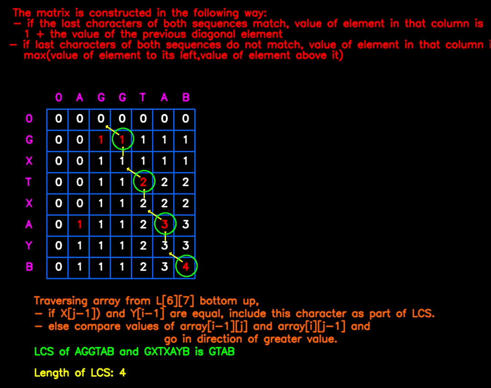

# LONGEST COMMON SUBSEQUENCE USING DYNAMIC PROGRAMMING

### **Concept:**
- LCS Problem Statement: Given two sequences, find the length of longest subsequence present in both of them. 
- A subsequence is a sequence that appears in the same relative order, but not necessarily contiguous.
- LCS problem is solved using dynamic programming, by creating a table based on certain conditions and then finding the LCS through a bottom up approach.

### **Required Packages:**
```
pip install opencv-python==3.4.1
pip install tensorflow==1.13.1
pip install Keras==2.0.6
pip install python==3.6.5
```
### **Model:**
- Model used for this code can be downloaded from the following link: <br>
    https://gitlab.com/school-of-curious/reshma-ramesh-babu/blob/develope/leastcommonsubsequence/emnist_new.h5
- Save it in the same folder as the python file and run the code

### **Approach:**
- To solve the LCS problem using dynamic programming, we create a table based on the following conditions:<br>
    If X and Y are the two strings that are being considered,
    * if X[i] equals Y[j], then LCS[i][j] = 1 + LCS[i-1][j-1], i.e. 1 plus the previous diagonal element
    * if X[i] and Y[j] are not equal, then LCS[i][j] = max(LCS[i-1][j],LCS[i][j-1]), i.e. maximum of the element directly to its left in the same row and the element directly above it in the previous row.
- To find the LCS, we traverse the formed matrix in a bottom up fashion, starting from the lower-right corner. 
    * If either the cell directly above or directly to the left contains equal values and less than the current cell, then move diagonally up.
    Output the associated value.
    * If the cell directly above and directly to the left contain unequal values, then move to the cell with the greater value of the two. 
    * Continue the above steps until you reach the first row(zeroes).


### **Code:**
- Save the following code in a new python file and run it 
```python
#importing libraries and dependencies
import cv2
import matplotlib.pyplot as plt
import numpy as np
from keras.models import Sequential
from keras.layers import Convolution2D, MaxPooling2D
from keras.layers import Flatten, Dense

#creating the model
def create_model():
    model = Sequential()
    model.add(Convolution2D(16, 5, 5, activation='relu', input_shape=(28,28,3)))
    model.add(MaxPooling2D(2, 2))

    model.add(Convolution2D(32, 5, 5, activation='relu'))
    model.add(MaxPooling2D(2, 2))

    model.add(Flatten())
    model.add(Dense(1000, activation='relu'))

    model.add(Dense(26, activation='softmax'))
    return model

#loading model
model = create_model()
model.load_weights('../emnist_new.h5')
def lcs(X , Y):
    x = 200
    y = 250
    p = 130
    q = 270 
    m = len(X)
    n = len(Y)
    print(m,n)
    L = [[0 for y in range(m+1)] for x in range(n+1)] 
    for i in range(n+1):
        print(L[i])
    print('\n')
    cv2.putText(output,"The matrix is constructed in the following way:",(50,50),cv2.FONT_HERSHEY_SIMPLEX,0.8,(0,0,255),2,cv2.LINE_AA)
    cv2.putText(output,"- if the last characters of both sequences match, value of element in that column is ",(50,75),cv2.FONT_HERSHEY_SIMPLEX,0.8,(0,0,255),2,cv2.LINE_AA)
    cv2.putText(output,"1 + the value of the previous diagonal element",(75,100),cv2.FONT_HERSHEY_SIMPLEX,0.8,(0,0,255),2,cv2.LINE_AA)
    cv2.putText(output,"- if last characters of both sequences do not match, value of element in that column is",(40,125),cv2.FONT_HERSHEY_SIMPLEX,0.8,(0,0,255),2,cv2.LINE_AA)
    cv2.putText(output,"max(value of element to its left,value of element above it)",(75,150),cv2.FONT_HERSHEY_SIMPLEX,0.8,(0,0,255),2,cv2.LINE_AA)
    
    cv2.putText(output,'0',(150,250),cv2.FONT_HERSHEY_SIMPLEX,0.8,(255,0,255),2,cv2.LINE_AA)
    cv2.putText(output,'0',(80,300),cv2.FONT_HERSHEY_SIMPLEX,0.8,(255,0,255),2,cv2.LINE_AA)
    for i in range(len(X)):
        cv2.putText(output,str(X[i]),(x,y),cv2.FONT_HERSHEY_SIMPLEX,0.8,(255,0,255),2,cv2.LINE_AA)
        x += 50
    x = 80
    y = 350
    for i in range(len(Y)):
        cv2.putText(output,str(Y[i]),(x,y),cv2.FONT_HERSHEY_SIMPLEX,0.8,(255,0,255),2,cv2.LINE_AA)
        y += 50
    for i in range(m+1):
        #cv2.rectangle(output,(p,q),(p + 50,q + 50),(255,0,0),2)
        for j in range(n+2):
            cv2.rectangle(output,(p,q+50),(p + 50,q + j*50),(255,100,0),2)
        p += 50
    # Following steps build L[m+1][n+1] in bottom up fashion. Note 
    # that L[i][j] contains length of LCS of X[0..i-1] and Y[0..j-1]  
    y = 250
    for i in range(n+1): 
        y += 50
        x = 150
        for j in range(m+1): 
            if i == 0 or j == 0:
                cv2.putText(output,str(L[i][j]),(x,y),cv2.FONT_HERSHEY_SIMPLEX,0.8,(255,255,255),2,cv2.LINE_AA)
            elif X[j-1] == Y[i-1]:
                cv2.putText(output,str(L[i][j]),(x,y),cv2.FONT_HERSHEY_SIMPLEX,0.8,(0,0,255),2,cv2.LINE_AA)
                cv2.putText(output,str(X[j-1])+" and "+str(Y[i-1])+" are equal",(650,500),cv2.FONT_HERSHEY_SIMPLEX,0.8,(0,255,0),2,cv2.LINE_AA)
                cv2.putText(output,"Element = array["+str(i-1)+"]["+str(j-1)+"] + 1",(650,530),cv2.FONT_HERSHEY_SIMPLEX,0.8,(0,255,0),2,cv2.LINE_AA)
            else:
                cv2.putText(output,str(X[j-1])+" and "+str(Y[i-1])+" are not equal",(650,500),cv2.FONT_HERSHEY_SIMPLEX,0.8,(0,255,0),2,cv2.LINE_AA)
                cv2.putText(output,"Element = Max(array["+str(i-1)+"]["+str(j)+"], array["+str(i)+"["+str(j-1)+"])",(600,530),cv2.FONT_HERSHEY_SIMPLEX,0.8,(0,255,0),2,cv2.LINE_AA)
            cv2.imshow('Output',output)
            if cv2.waitKey(0) & 0xFF == ord('a'):
                cv2.destroyWindow('Output')
            if X[j-1] == Y[i-1]:
                cv2.putText(output,str(L[i][j]),(x,y),cv2.FONT_HERSHEY_SIMPLEX,0.8,(0,0,0),2,cv2.LINE_AA)
            if i == 0 or j == 0: 
                L[i][j] = 0
                cv2.putText(output,str(L[i][j]),(x,y),cv2.FONT_HERSHEY_SIMPLEX,0.8,(255,255,255),2,cv2.LINE_AA)
            elif X[j-1] == Y[i-1]: 
                L[i][j] = L[i-1][j-1] + 1
                cv2.putText(output,str(L[i][j]),(x,y),cv2.FONT_HERSHEY_SIMPLEX,0.8,(0,0,255),2,cv2.LINE_AA)
            else: 
                L[i][j] = max(L[i-1][j], L[i][j-1]) 
                cv2.putText(output,str(L[i][j]),(x,y),cv2.FONT_HERSHEY_SIMPLEX,0.8,(255,255,255),2,cv2.LINE_AA)
            cv2.rectangle(output,(600,400),(1200,800),(0,0,0),-1)
            x += 50
    cv2.imshow('Output',output)
    if cv2.waitKey(0) & 0xFF == ord('a'):
        cv2.destroyWindow('Output')        
    
    print(L[n][m])
    # Following code is used to print LCS 
    index = L[n][m] 
  
    # Create a character array to store the lcs string 
    lcs = [""] * (index+1) 
    lcs[index] = "" 
    # Start from the right-most-bottom-most corner and 
    # one by one store characters in lcs[] 
    i = n 
    j = m 
    while i > 0 and j > 0: 
        # If current character in X and Y are same, then 
        # current character is part of LCS 
        if X[j-1] == Y[i-1]: 
            lcs[index-1] = X[j-1] 
            print(lcs[index-1])
            i-=1
            j-=1
            index-=1
            cv2.arrowedLine(output,(x-50,y-20),(x-80,y-40),(0,255,255),2)
            cv2.circle(output,(x - 40,y - 10),25, (0,255,0), 2)
            cv2.arrowedLine(output,(x-100,y-120),(x-130,y-140),(0,255,255),2)
            cv2.circle(output,(x - 90,y - 110),25, (0,255,0), 2)
            cv2.arrowedLine(output,(x-150,y-220),(x-180,y-240),(0,255,255),2)
            cv2.circle(output,(x - 140,y - 210),25, (0,255,0), 2)
            cv2.arrowedLine(output,(x-200,y-320),(x-230,y-340),(0,255,255),2)
            cv2.circle(output,(x - 190,y - 310),25, (0,255,0), 2)
        # If not same, then find the larger of two and 
        # go in the direction of larger value 
        elif L[i-1][j] > L[i][j-1]: 
            i-=1
            cv2.arrowedLine(output,(x-90,y-70),(x-90,y-90),(0,255,255),2)
            cv2.arrowedLine(output,(x-140,y-170),(x-140,y-190),(0,255,255),2)
            cv2.arrowedLine(output,(x-190,y-270),(x-190,y-290),(0,255,255),2)
        else: 
            j-=1
    s="".join(lcs)
    print ("\nLCS of " + X + " and " + Y + " is " + "".join(lcs))
    
    cv2.putText(output,"Traversing array from L["+str(m)+"]["+str(n)+"] bottom up,",(100,730),cv2.FONT_HERSHEY_SIMPLEX,0.8,(10,100,255),2,cv2.LINE_AA)
    cv2.putText(output,"- if X[j-1]) and Y[i-1] are equal, include this character as part of LCS.",(100,760),cv2.FONT_HERSHEY_SIMPLEX,0.8,(10,100,255),2,cv2.LINE_AA)
    cv2.putText(output,"- else compare values of array[i-1][j] and array[i][j-1] and ",(100,790),cv2.FONT_HERSHEY_SIMPLEX,0.8,(10,100,255),2,cv2.LINE_AA)
    cv2.putText(output,"                        go in direction of greater value.",(100,820),cv2.FONT_HERSHEY_SIMPLEX,0.8,(10,100,255),2,cv2.LINE_AA)
    
    # L[m][n] contains the length of LCS of X[0..n-1] & Y[0..m-1] 
    cv2.putText(output,"LCS of "+str(X)+" and "+str(Y)+" is "+str(s),(100,850),cv2.FONT_HERSHEY_SIMPLEX,0.8,(0,255,0),2,cv2.LINE_AA)
    cv2.putText(output,"Length of LCS: "+str(L[n][m]),(100,900),cv2.FONT_HERSHEY_SIMPLEX,0.8,(0,255,255),2,cv2.LINE_AA)
    cv2.imshow('Output',output)
    if cv2.waitKey(0) & 0xFF == ord('a'):
        cv2.destroyWindow('Output')     
    

global ARR,ARR1
import operator
cap = cv2.VideoCapture(1)
st = ""
count = 0
count1 = 0
count2 = 0
flag = 0
while(True):
    #reading frames from camera
    ret, frame1 = cap.read()
    frame = frame1.copy()
    frame_new= frame1.copy()
    output = np.zeros((1000,1200,3),np.uint8)
    frame5=np.zeros((1200,1200,3),np.uint8)
    if cv2.waitKey(1) & 0xFF == ord('s'):
        count1 += 1
    if cv2.waitKey(1) & 0xFF == ord('l'):
        count = 1
    
    if flag == 0:
        frame2 = frame1[50:200,100:700]
        frame = frame2.copy()
        frame_new= frame2.copy()
        th1 = 78
        ret, img = cv2.threshold(frame, th1, 255, cv2.THRESH_BINARY_INV)
        cvt = cv2.cvtColor(img, cv2.COLOR_BGR2GRAY)
        imagenew,contours, hierarchy = cv2.findContours(cvt,cv2.RETR_EXTERNAL,cv2.CHAIN_APPROX_SIMPLE)

        thisdict = {}
        thisdict1 = {}
        
        flag=0
        noted_y=0
        mylist = []
        for c in contours:
            (x, y, w, h)= cv2.boundingRect(c)
            if (w>20) or (h>20):
                mylist.append((x,y,w,h))
        
        th2 = 82 #change thresholding of every contour
        for i in range(0, len(mylist)):
            x = mylist[i][0]
            y = mylist[i][1]
            w = mylist[i][2]
            h = mylist[i][3]
            if h/w>3:
                x=x-10
                w=w+20
            if w/h>3:
                y=y-60
                h=h+110
            y=y-27
            x=x-25
            w=w+50
            h=h+54
            cv2.rectangle(frame2,(x,y),(x+w,y+h), (0,0, 255), 2)
            img1 = frame_new[y:y+h, x:x+w]
            ret, gray = cv2.threshold(img1,th2,255,cv2.THRESH_BINARY )
            try:
                im = cv2.resize(gray, (28,28))
                #cv2.imshow('img',gray)

                ar = np.array(im).reshape((28,28,3))
                ar = np.expand_dims(ar, axis=0)
                prediction = model.predict(ar)[0]
                #prediction of class labels
                for i in range(0,27):
                    if prediction[i]==1.0:
                        if i==0:
                            j1= "A"
                        if i==1:
                            j1= "B"
                        if i==2:
                            j1= "C"
                        if i==3:
                            j1= "D"
                        if i==4:
                            j1= "E"
                        if i==5:
                            j1= "F"
                        if i==6:
                            j1= "G"
                        if i==7:
                            j1= "H"
                        if i==8:
                            j1= "I"
                        if i==9:
                            j1= "J"
                        if i==10:
                            j1= "K"
                        if i==11:
                            j1= "L"
                        if i==12:
                            j1= "M"
                        if i==13:
                            j1= "N"
                        if i==14:
                            j1= "O"
                        if i==15:
                            j1= "P"
                        if i==16:
                            j1= "Q"
                        if i==17:
                            j1= "R"
                        if i==18:
                            j1= "S"
                        if i==19:
                            j1= "T"
                        if i==20:
                            j1= "U"
                        if i==21:
                            j1= "V"
                        if i==22:
                            j1= "W"
                        if i==23:
                            j1= "X"
                        if i==24:
                            j1= "Y"
                        if i==25:
                            j1= "Z"
                        thisdict1[x]= str(j1)  
                #printing prediction
                        cv2.putText(frame1, j1, (x,y), cv2.FONT_HERSHEY_SIMPLEX, 2, (0, 255, 0), 2, cv2.LINE_AA)
            except:
                d=0

            sort = sorted(thisdict1.items(), key=operator.itemgetter(0))
            s = ""
        for x in range(0,len(sort)):
                s=s+str(sort[x][1])
                cv2.putText(frame2, s, (100,80), cv2.FONT_HERSHEY_SIMPLEX, 2, (255, 0, 0), 2, cv2.LINE_AA)  
            
        frame3 = frame1[200:400,100:700]
        frame = frame3.copy()
        frame_new= frame3.copy()
        th1 = 78
        ret, img = cv2.threshold(frame, th1, 255, cv2.THRESH_BINARY_INV)
        cvt = cv2.cvtColor(img, cv2.COLOR_BGR2GRAY)
        imagenew,contours, hierarchy = cv2.findContours(cvt,cv2.RETR_EXTERNAL,cv2.CHAIN_APPROX_SIMPLE)

        thisdict = {}
        thisdict1 = {}
        
        flag=0
        noted_y=0
        mylist = []
        for c in contours:
            (x, y, w, h)= cv2.boundingRect(c)
            if (w>20) or (h>20):
                mylist.append((x,y,w,h))
        
        th2 = 82 #change thresholding of every contour
        for i in range(0, len(mylist)):
            x = mylist[i][0]
            y = mylist[i][1]
            w = mylist[i][2]
            h = mylist[i][3]
            if h/w>3:
                x=x-10
                w=w+20
            if w/h>3:
                y=y-60
                h=h+110
            y=y-27
            x=x-25
            w=w+50
            h=h+54
            cv2.rectangle(frame3,(x,y),(x+w,y+h), (0,0, 255), 2)
            img1 = frame_new[y:y+h, x:x+w]
            ret, gray = cv2.threshold(img1,th2,255,cv2.THRESH_BINARY )
            try:
                im = cv2.resize(gray, (28,28))
                #cv2.imshow('img',gray)

                ar = np.array(im).reshape((28,28,3))
                ar = np.expand_dims(ar, axis=0)
                prediction = model.predict(ar)[0]
                #prediction of class labels
                for i in range(0,27):
                    if prediction[i]==1.0:
                        if i==0:
                            j1= "A"
                        if i==1:
                            j1= "B"
                        if i==2:
                            j1= "C"
                        if i==3:
                            j1= "D"
                        if i==4:
                            j1= "E"
                        if i==5:
                            j1= "F"
                        if i==6:
                            j1= "G"
                        if i==7:
                            j1= "H"
                        if i==8:
                            j1= "I"
                        if i==9:
                            j1= "J"
                        if i==10:
                            j1= "K"
                        if i==11:
                            j1= "L"
                        if i==12:
                            j1= "M"
                        if i==13:
                            j1= "N"
                        if i==14:
                            j1= "O"
                        if i==15:
                            j1= "P"
                        if i==16:
                            j1= "Q"
                        if i==17:
                            j1= "R"
                        if i==18:
                            j1= "S"
                        if i==19:
                            j1= "T"
                        if i==20:
                            j1= "U"
                        if i==21:
                            j1= "V"
                        if i==22:
                            j1= "W"
                        if i==23:
                            j1= "X"
                        if i==24:
                            j1= "Y"
                        if i==25:
                            j1= "Z"
                        thisdict1[x]= str(j1)  
                #printing prediction
                        cv2.putText(frame1, j1, (x,y), cv2.FONT_HERSHEY_SIMPLEX, 2, (0, 255, 0), 2, cv2.LINE_AA)
            except:
                d=0

            sort = sorted(thisdict1.items(), key=operator.itemgetter(0))
            s1 = ""
        for x in range(0,len(sort)):
            s1=s1+str(sort[x][1])
            cv2.putText(frame3, s1, (100,80), cv2.FONT_HERSHEY_SIMPLEX, 2, (255, 0, 0), 2, cv2.LINE_AA)  
        try:
            print(s,s1)
            ARR=s
            ARR1=s1
            if count == 1:
                lcs(s,s1)
                count = 2
                flag = 1
                count2 = 1
            cv2.imshow('Output',output)
        except:
            pass
        if count2 == 1:
            cv2.putText(frame5,"def lcs(X, Y): ",(50,60),0,0.8,(10,100,255),2)
            cv2.putText(frame5,"    m = len(X)",(50,90),0,0.8,(10,100,255),2)
            cv2.putText(frame5,"    n = len(Y)",(50,120),0,0.8,(10,100,255),2)
            cv2.putText(frame5,"    L = [[0 for y in range(m+1)] for x in range(n+1)] ",(50,150),0,0.8,(10,100,255),2)
            cv2.putText(frame5,"    for i in range(n+1): ",(50,180),0,0.8,(10,100,255),2)
            cv2.putText(frame5,"        for j in range(m+1): ",(50,210),0,0.8,(10,100,255),2)
            cv2.putText(frame5,"            if i == 0 or j == 0: ",(50,240),0,0.8,(10,100,255),2)
            cv2.putText(frame5,"                L[i][j] = 0",(50,270),0,0.8,(10,100,255),2)
            cv2.putText(frame5,"            elif X[j-1] == Y[i-1]: ",(50,300),0,0.8,(10,100,255),2)
            cv2.putText(frame5,"                L[i][j] = L[i-1][j-1] + 1",(50,330),0,0.8,(10,100,255),2)
            cv2.putText(frame5,"            else: ",(50,360),0,0.8,(10,100,255),2)
            cv2.putText(frame5,"                L[i][j] = max(L[i-1][j], L[i][j-1]) ",(50,390),0,0.8,(10,100,255),2)
            cv2.putText(frame5,"    index = L[n][m] ",(50,420),0,0.8,(10,100,255),2)
            cv2.putText(frame5,"    lcs = [''] * (index+1)",(50,450),0,0.8,(10,100,255),2)
            cv2.putText(frame5,"    lcs[index] = ''",(50,480),0,0.8,(10,100,255),2)
            cv2.putText(frame5,"    i = n ",(50,510),0,0.8,(10,100,255),2)
            cv2.putText(frame5,"    j = m ",(50,540),0,0.8,(10,100,255),2)
            cv2.putText(frame5,"    while i > 0 and j > 0: ",(50,570),0,0.8,(10,100,255),2)
            cv2.putText(frame5,"        if X[j-1] == Y[i-1]:  ",(50,600),0,0.8,(10,100,255),2)
            cv2.putText(frame5,"            lcs[index-1] = X[j-1] ",(50,630),0,0.8,(10,100,255),2)
            cv2.putText(frame5,"            i-=1",(50,660),0,0.8,(10,100,255),2)
            cv2.putText(frame5,"            j-=1",(50,690),0,0.8,(10,100,255),2)
            cv2.putText(frame5,"            index-=1",(50,720),0,0.8,(10,100,255),2)
            cv2.putText(frame5,"        elif L[i-1][j] > L[i][j-1]: ",(50,750),0,0.8,(10,100,255),2)
            cv2.putText(frame5,"            i-=1",(50,780),0,0.8,(10,100,255),2)
            cv2.putText(frame5,"        else: ",(50,810),0,0.8,(10,100,255),2)
            cv2.putText(frame5,"            j-=1",(50,840),0,0.8,(10,100,255),2)
            cv2.putText(frame5,"    print (' LCS of ' + X + ' and ' + Y + ' is ' + ''.join(lcs) ",(50,870),0,0.8,(10,100,255),2)
            cv2.putText(frame5,"    return L[n][m] ",(50,900),0,0.8,(10,100,255),2)
            cv2.putText(frame5,"X = "+str(ARR),(50,930),0,0.8,(10,100,255),2)
            cv2.putText(frame5,"Y = "+str(ARR1),(50,960),0,0.8,(10,100,255),2)
            cv2.putText(frame5,"print (' Length of LCS is ', lcs(X, Y) )",(50,990),0,0.8,(10,100,255),2)
            cv2.imshow("Least Common Subsequence",frame5)                  
    cv2.imshow('frame1', img)
    #cv2.imshow('fram', im)
    cv2.imshow('frame', frame1)
    cv2.imshow('frame2', frame2)
    cv2.imshow('frame3', frame3)
    if cv2.waitKey(1) & 0xFF == ord('q'):
        break        
cap.release()
#code for basic code generation of least common subsequence
f1 = open("lcscodegen.py","w+")
code = '''
# Dynamic Programming implementation of LCS problem  
# Returns length of LCS for X[0..m-1], Y[0..n-1]  
def lcs(X, Y): 
    m = len(X)
    n = len(Y)
    L = [[0 for y in range(m+1)] for x in range(n+1)] 
    # Following steps build L[m+1][n+1] in bottom up fashion. Note 
    # that L[i][j] contains length of LCS of X[0..i-1] and Y[0..j-1]  
    for i in range(n+1): 
        for j in range(m+1): 
            if i == 0 or j == 0: 
                L[i][j] = 0
            elif X[j-1] == Y[i-1]: 
                L[i][j] = L[i-1][j-1] + 1
            else: 
                L[i][j] = max(L[i-1][j], L[i][j-1]) 
    
    # Following code is used to print LCS 
    index = L[n][m] 
    # Create a character array to store the lcs string 
    lcs = [""] * (index+1) 
    lcs[index] = "" 
    # Start from the right-most-bottom-most corner and 
    # one by one store characters in lcs[] 
    i = n 
    j = m 
    while i > 0 and j > 0: 
        # If current character in X[] and Y are same, then 
        # current character is part of LCS 
        if X[j-1] == Y[i-1]: 
            lcs[index-1] = X[j-1] 
            i-=1
            j-=1
            index-=1
        # If not same, then find the larger of two and 
        # go in the direction of larger value 
        elif L[i-1][j] > L[i][j-1]: 
            i-=1
        else: 
            j-=1
    print ("\nLCS of " + X + " and " + Y + " is " + "".join(lcs))
    # L[m][n] contains the length of LCS of X[0..n-1] & Y[0..m-1] 
    return L[n][m] 
#end of function lcs 
  
# Driver program to test the above function 
X = '''+str(ARR)+'''
Y = '''+str(ARR1)+'''
print ("\nLength of LCS is ", lcs(X, Y) )
'''
f1.write(code)
f1.close()
```
- Run the above code using the following command
```
python3 lcshw.py
```
### **Operation:**
- The main frame that captures the handwritten input is split into two: each to read the two strings that are compared to obtain the LCS.
- The output is displayed on pressing the key 'l'.
- Array gets filled with elements one by one on key press along with explanation. 
- LCS is obtained from the table by the steps explained above on key press
- On pressing key 'c', basic code for LCS is generated. 

### **Output Screenshot:**


### **Demo video link:**
https://www.dropbox.com/s/41x2lclmfj9o383/lcshw.mp4?dl=0